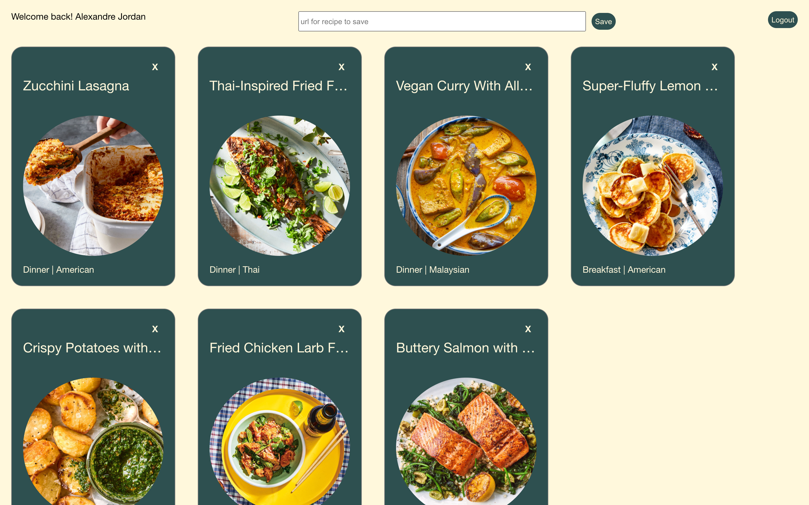

## Just my Recipe
Just my recipe is a simple web app where you can save recipes without any of the bloat found around it (author's story of how they came up with the recipe, their life story, etc.). 

Still a work in progress - next steps will be to add more support for recipe data formats around the web (currently it works really well for recent recipes posted on Food52.com - your mileage will vary with other websites). I also want to add dynamic filters (that are populated with values from the user's recipes) and search to be able to more easily find saved recipes.

You can view/use it here: [Just my Recipe](https://recipe-saver-f431f.web.app/)

## Motivation
Wanted to build something in TypeScript as I had not done so before and had always wanted a simple place to keep the recipes that I like but had never found the appropriate tool for it.

I also wanted to use Heroku to deploy an API endpoint as that is also something that I had no previous experience doing.

Happy to have managed to do both :)

## Build status
Definitely a work in progress - happy to get feedback/ideas :)

## Screenshots

## Tech/framework used
- HTML
- Sass
- Vanilla JS

## Features
- Sign in, sign out - saved recipes segregated by user
- Save recipes from the web by using the input box on the main page
- Use the Chrome Extension to save recipes while browsing (can also be used to create a print friendly format)
  
## Chrome Extension
I am in the process of getting the Chrome Extension approved for the Chrome Web Store, in the meantime it is included in the files in this repo in a folder called Extension which can be loaded into Chrome.
